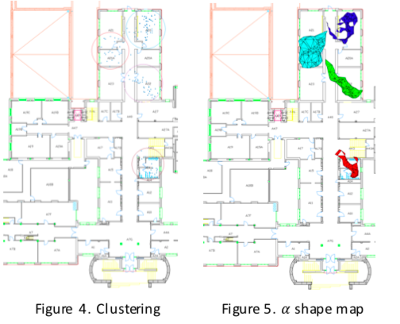

## SLAM for unsupervised learning in Indoor Environment

# Description
The framework formed a trajectory model using sensor fusion techniques on inertial data recorded from a smartphone.  This resulted in paths that were segmented for an unsupervised learning algorithm to classify indoor landmarks that were used to improve localization.
 

    

