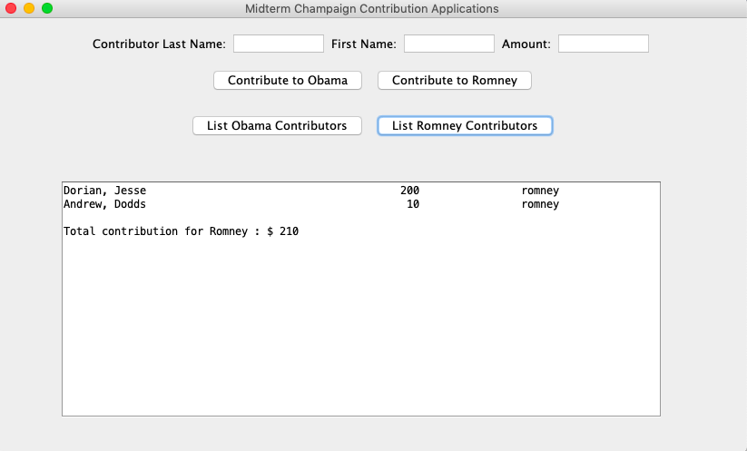
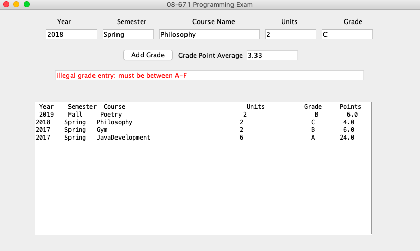
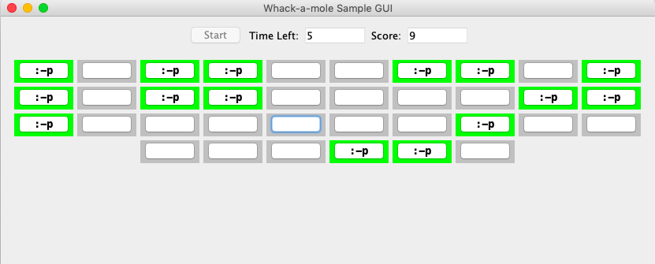
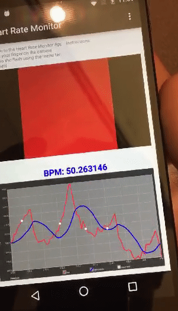
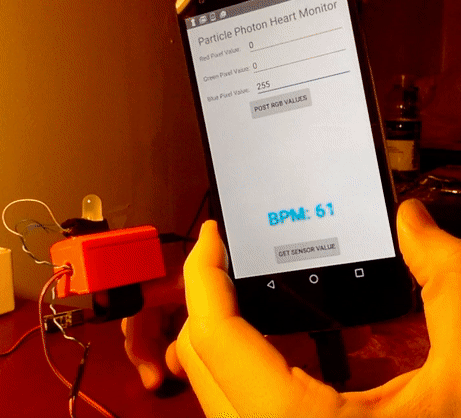
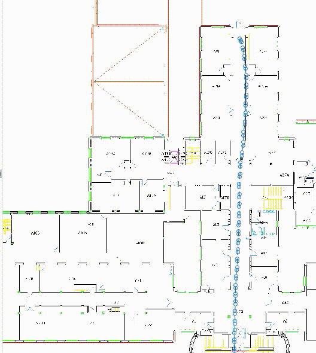
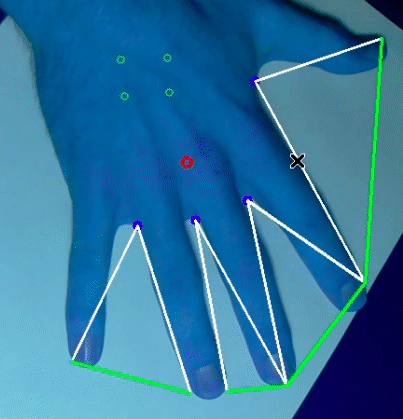
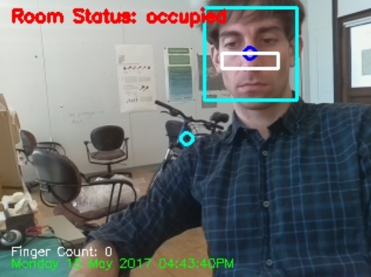
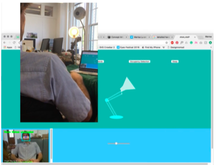

# Sample Work
## About
This repository contains a sample of the work that I completed while in graduate school (2016-2017).

## Table of Contents
- [Sample Work](#sample-work)
  * [About](#about)
  * [Table of Contents](#table-of-contents)
  * [Computer Systems](#computer-systems)
  * [Java Application Development](#java-application-development)
  * [Android Development](#android-development)
      + [HeartBeatMonitor](#HeartBeatMonitor)
      + [HeartBeatMonitor-PP](#HeartBeatMonitor-PP)
  * [Indoor SLAM](#indoor-slam)
  * [SmartLamp](#smart-lamp)
  * [Contact](#contact)

## Computer Systems
This is a short list of lab that I completed in a course designed to teach the principles of computer systems.
     
    - Data Lab
     
    - Cache Lab
     
    - Malloc Lab
     
    - Proxy Lab
     
    - Shell Lab

## Java Application Development
This folder contains two java applications that I development as a part of a course instructed to teach object oriented programming for java.
   
  

    
    <figcaption>Donor List</figcaption>
    
    <figcaption>GPA Calculator</figcaption>
  

  

    
    <figcaption>Whack-a-Mole</figcaption>
  

   

## Android Development
This folder contains a sample of the android app development that I have completed.  The android applications are listed below:

# HeartBeatMonitor
This is an android app to detect the users heart rate (BPM) by processing Android’s built in camera pixel values using openCV.  I added two additional features (finger detection and shake detection) to account for conditions that may lead to inaccurate readings.

Finger Detection: This tracks the smoothed red pixel values that are recorded and ensures that BPM calculations are only computed if they cross a threshold value (chosen as 190).The timestamp at which Pixel values fail to exceed this threshold are recorded (to prohibit the BPM from being calculated before this time point) and a message is displayed on the screen to inform the user.

Shake Detection: This tracks the magnitude of the 3-axis accelerometer values that are recorded to ensure that BPM calculation are not computed under unsteady conditions (acceleration magnitude values that cross threshold value chosen as 1). The timestamp at which the phone is determined to be unsteady is recorded (to prohibit the BPM from being calculated before this time point) and a message is displayed on the screen to inform the user.
 

    

# HeartBeatMonitor-PP
This is a pulse sensor that works as a wearable device that you strap to your fingertip.
Within the 3d printed casing (a) is a switch that can be used to turn on the particle photon.
Upon start-up: the RGB LED will flash Red, Green and Blue then begin to track user heart rate.  The RGB LED flashes every time that a pulse is detected.  It can also "pulsate" given a minor change to (b).  The Android app communicates (c) with the particle photon by receiving BPM values that are process on the particle photon and displaying the value on the screen.  Furthermore, it can transmit commands to change the RGB value that flashes to inform the user of a heart beat.
 

    

### Indoor SLAM for Unsupervised learning

Unsupervised learning framework using simulatenous localization and mapping to classify indoor spaces. 
 
 
Corridor Mapping: 
    

### Smart Lamp

The smart lamp 'AnaLamp' is an interactive desktop lamp, built with animated features and designed to assistant users remotely and at work. Analamp uses IoT technology and computer vision to extend the control users have at and away from a work site. The lamp provides manual Web application control and automated features for face tracking, remote occupancy detection and hand gesture control.
 
 
Hand Gesture control: 
    

 
 
Face Tracking:  
    

 
 
Web App Interface : 
    

## Contact
If you have any questions/comments feel free to shoot me an email.

[wmm5035@gmail.com](mailto:wmm5035@gmail.com)  

