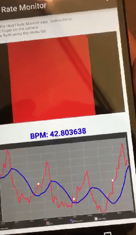
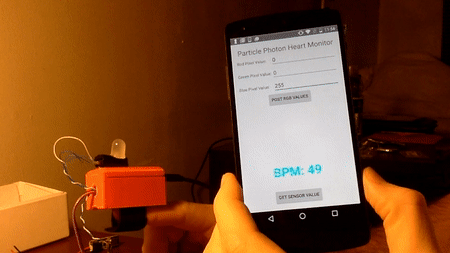

# Sample Work

## About
This is a directory containing a sample of the work that I completed over the last year (2017).

## Table of Contents
- [Sample Work](#sample-work)
  * [About](#about)
  * [Table of Contents](#table-of-contents)
  * [Android Development](#android-development)
      + [HeartBeatMonitor](#HeartBeatMonitor)
      + [HeartBeatMonitor-PP](#HeartBeatMonitor-PP)
      + [StepTracker](#StepTracker)
  * [Machine Learning](#machine-learning)
      + [Notebook](#notebook)
      + [lib](#lib)
  * [SmartLamp](#smart-lamp)
  * [Contact](#contact)

## Android Development
This folder contains a sample of the android app development that I have completed.  The android applications are listed below:

### HeartBeatMonitor
This is an android app to detect the users heart rate (BPM) by processing Android’s built in camera pixel values using openCV.  I added two additional features (finger detection and shake detection) to account for conditions that may lead to inaccurate readings.

Finger Detection: This tracks the smoothed red pixel values that are recorded and ensures that BPM calculations are only computed if they cross a threshold value (chosen as 190).The timestamp at which Pixel values fail to exceed this threshold are recorded (to prohibit the BPM from being calculated before this time point) and a message is displayed on the screen to inform the user.

Shake Detection: This tracks the magnitude of the 3-axis accelerometer values that are recorded to ensure that BPM calculation are not computed under unsteady conditions (acceleration magnitude values that cross threshold value chosen as 1). The timestamp at which the phone is determined to be unsteady is recorded (to prohibit the BPM from being calculated before this time point) and a message is displayed on the screen to inform the user.
 

    

### HeartBeatMonitor-PP
This is a pulse sensor that works as a wearable device that you strap to your fingertip.
Within the 3d printed casing (a) is a switch that can be used to turn on the particle photon.
Upon start-up: the RGB LED will flash Red, Green and Blue then begin to track user heart rate.  The RGB LED flashes every time that a pulse is detected.  It can also "pulsate" given a minor change to (b).  The Android app communicates (c) with the particle photon by receiving BPM values that are process on the particle photon and displaying the value on the screen.  Furthermore, it can transmit commands to change the RGB value that flashes to inform the user of a heart beat.
 

    

### StepTracker
This android application tracks the steps that have been taken by users.  The direction that the user is facing is logged with each step count to then map out the trajectory of the user.

    

## Machine Learning
This is a general purpose workspace to review Machine Learning algorithms.

In general, this work is inspired by the material covered by Professor Matt Gormley course at Carnegie Mellon (here [here](http://www.cs.cmu.edu/~mgormley/courses/10601-s17/index.html)). Any error in the Python code should be attribued to me and not the aforemention author.

For additional resources, check out:
[awesome-machine-learning](https://github.com/josephmisiti/awesome-machine-learning)

The work in this repository is intended to explore core concepts and provide working examples to reinforce the learning of the subject matter.  All work is developed in Python.
### lib
Python library to build a multi-layered fully connected Neural Network.

### notebook
iPython scripts to explore core machine learning algorithms:
    - Linear Regression
    - Logistic Regression
    - Neural Net
    - SVM
    - k-means
    - PCA

## Data Structures and Algorithms
This is a general purpose workspace to review Data Structures and Sorting Algorithms.
Any error in the Python code should be attribued to me .

The work in this repository is intended to explore core concepts and provide working examples to reinforce the learning of the subject matter.  All work is developed in Python.
### lib
Python library to easily import Data structures and Algorithms written in notebook

### notebook
iPython scripts to explore Data Structures and Algorithms:
    - Data Structures:
        - DynamicArray
        - Doubly Linked List
        - Stack
        - Queue
        - Deque
    - Algorithms:
        - binary_search
        - selection_sort
        - insertion_sort
        - merge_sort
        - quick_sort

### Smart Lamp

The smart lamp 'AnaLamp' is an interactive desktop lamp, built with animated features and designed to assistant users remotely and at work. Analamp uses IoT technology and computer vision to extend the control users have at and away from a work site. The lamp provides manual Web application control and automated features for face tracking, remote occupancy detection and hand gesture control.
 
Hand Gesture control Feature:
 
 

    

 
Face Tracking Feature:
 
 

    

 
Occupancy Detection Feature:
 
 

    

Helpful Resources:

[Configuring OpenCV/Python for RasPI](http://www.pyimagesearch.com/2015/03/30/accessing-the-raspberry-pi-camera-with-opencv-and-python/):  This is a step-by-step tutorial on how to configure your raspberry pi to use OpenCV.

[FLASK](https://blog.miguelgrinberg.com/post/video-streaming-with-flask):   This is a helpful blog to explain how flask works (the python library that is used to post motion jpegs to the web)

[Haar Cascades Classifiers (Face Detection)](https://pythonprogramming.net/haar-cascade-face-eye-detection-python-opencv-tutorial/):  This is a python/openCV tutorial on how to implement Haar Cascades for face detection.  Can also be used for other objects (eyes, ears, keys etc..).  There is also information on how to create your own Haar Cascade xml file.
